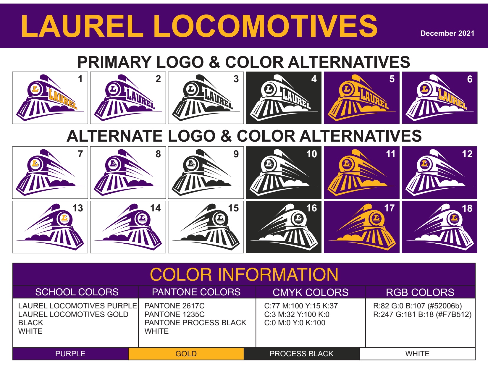

## [Activites District Website Page](https://www.laurel.k12.mt.us/departments/activities)
## Follow <a href="https://twitter.com/LPSActivities?ref_src=twsrc%5Etfw" class="twitter-follow-button" data-show-count="false">@LPSActivities</a> On Twitter

---

## [Event Tickets](https://gofan.co/app/school/MT14360)
---

## [Activities Registration and Eligibility](https://max.dragonflyathletics.com/maxweb/)
---

## Physicals

    
 Details

WHO: All Laurel Middle and High School Athletes

WHAT: Onsite $25 sports physicals at Laugh High School on the Billings Clinic Bus Payable by cash, check, or charge – Please make checks payable to “Billings Clinic Occupational Health”

WHEN: June 1st, June 2nd, August 4th and August 5th

NOTE: If these dates don’t work for your family, feel free to call Billings Clinic Occupational Health at 406-247-6200 to set up your athlete’s appointment
WHERE: Laurel High School parking lot

HOW: Sign-up sheets are available at the Middle School and High School main offices April 19th to June 10th in person. Sign -up sheets will then be available in the Laurel Public Schools District Office June 13th to July 29th in person

WHY: Making it fast, easy and convenient for families to get their children’s sports physical completed prior to the start of the athletic season. If you have any questions or concerns, please feel free to reach out to me directly and I will be happy to assist.

Paula S. Miller, WHP, PHR, SHRM-CP

Occupational Health, Employee Health and EAP Manager

1020 N. 27th st, Suite 301

Billings MT 59101
PH: 406-435-6215

FAX: 406-435-6236

---
## [Watch Activities Live!](https://www.nfhsnetwork.com/schools/laurel-high-school-laurel-mt)
---

## Sponsorship Opportunities

- [Partnership Info](https://express.adobe.com/page/VvJ63o1ggJOr4/)
- [Partnership Packages](https://www.laurel.k12.mt.us/fs/resource-manager/view/f83ac20b-31a2-47bb-a99e-78b8c43708fc)

---

## [Parent/Athlete Forms](/docs/Parent/Parent%20Links.md#athletics-and-activities)

---

## [Volunteer Form](https://forms.gle/ZMqZajkLaYx8RQov8)
---

## Participation Forms
- [Pledge Form](https://www.laurel.k12.mt.us/fs/resource-manager/view/6d05fbfd-a695-4bcd-aeae-200a8a3cb3a3)
- [Concussion Form](https://www.laurel.k12.mt.us/fs/resource-manager/view/0726482d-0aab-4957-9744-75eca02036f9)
- [Sports Physical Form](https://cdn1.sportngin.com/attachments/document/ad7e-1857956/Pre-participationPhysicalForm-2022-23_1_.pdf#_ga=2.225630942.511108639.1660254334-1992758709.1660254333)

---

## Locomotives Style Guide
