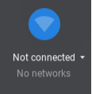

# How To Connect a Chromebook to Wifi

## How To

1. Click the menu in the bottom right hand corner of the screen 

2. When that menu opens, click on the wifi tab

3. From here, you will see all wifi networks close to you. Click the one that belongs to you and enter your network password.
