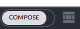
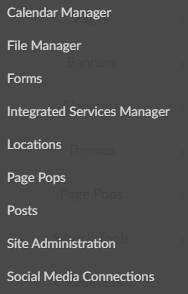

# District Website Info

The district website is managed by FinalSite, and we are only able to make changes through their provided back end editor system. This guide will go over the basics, and you should be able to learn from there. 

## Staff Login

Any Staff member has the ability to log in and update their staff directory profile by clicking the `Edit Staff Directory Profile` link at the bottom of any page.

## Admin Login

Users with administrative access can login to the back end of the website by following the `Admin Login` link at the bottom of the main page. Alternatively, you can access the admin site directly with this link [https://laurel.k12.mt.us/fs/admin](https://laurel.k12.mt.us/fs/admin). Your login is your district email address and password. You must be granted access to the websites backend, if you can't login, you can reach out to IT to request access.

---

## Finalsite backend

Finalsite's backend consists of 4 major sections, each can be accessed from the sidebar on the left side of the screen.

 
The sections are as follows from top to bottom:
1. Composer
2. Modules
3. People
4. Resources

## Composer
Composer is where the majority of all editing to the site takes place.

 
For editing specific web pages, we'll go to `Pages`. Anything below pages is considered advanced and should be edited with caution.

### Pages
The pages panel displays a tree view of our entire website's layout, separated by building. Under the `Laurel Public Schools` tab, you will find all of the utility pages. These are used for editing main site components such as the headers, footers, and quick links navigation elements. FS also provided an excellent page here labeled [Instructions](https://www.laurel.k12.mt.us/fs/admin/site/pages/1984) which gives in depth details on how to edit all of the site's elements. Use this page for detailed instructions on how to use composer to edit pages.

#### Lets Start Editing 
*Please note that we are only editing page content. Changing headers and footers are more complicated and should be edited by IT*

-  In the main compose window, you can navigate to the page you want to edit by using the bar on the left hand side, or by simply navigating there in the main window. For this example, we're going to edit the LHS Library Page. 

- In the bottom left hand corner of the page to the right of the navigation bar, is the compose button  . When you goggle this button, Everything on the page becomes editable.  

#### Layouts and Elements

The 2 main components you work with when editing pages are layouts and elements. Think of layouts as boxes and elements are the things inside of the box. You can also add boxes inside of boxes! These help determine the layout of your page and keep you from having to fight with writing annoying html and css.....though finalsites editor can be a fight sometimes, believe me, I know. 

---

##### Layouts
When you first turn on Compose you'll notice that there are boxes surrounding everything on the page. These are the different Layouts.  You'll notice when we hover our mouse over different items on the page, we see little gray boxes in the righthand corner of each element. Lets hover over the outermost box on the page.   Layouts have 5 possible options. From left to right we have the layout options, copy, settings, delete, and below that, a button that allows you to click and drag to move the entire element.

Looking at the first option, layout options

This is what allows you to set the shape of your page, or in other words, how you organize your boxes, or is it just one big box? You'll see most pages on the site either have no division and are just a single section, or have the 4th option of a bigger section on the left, with a smaller section on the right. Feel free to choose whichever works for you. 

The other 4 options from the hover menu, copy, settings, delete, and drag also apply to Elements, which we'll cover in a bit. Copy and delete are pretty self explanatory but the settings tab is where you'll go to adjust almost every type of layout or element you add to a page so lets take a look at that. 

What's available in the settings tab changes depending on what type of page element you're editing, but they all have the Title, which will put whatever you want, defaults to the type of element,  at the top left corner of the element. Or you can turn it off if your element doesn't need a title, which we usually do for the outmost element. 

---

##### Elements 

Elements are the bread and butter of the web pages. Or the meat and potatoes? Whatever you would put inside the boxes from the box analogy, that's what they are! 

When hovering our mouse over an element we see a few different options. First notice how we have the sub divided layout. Because of this, we have the ability to add an element in the left or right side, or a new full size element or layout underneath the subdivided layout. By clicking `Add Element` we'll be able to see all the different things we can add to a page.  

 

There are quite a bit of options here, but not all are used throughout the site. The primary options we use are `Content` `Image` `Resource` `Posts` and from the Layout tab, this is where you can divide up the page with even more sub layouts, or you have the Accordion and Tabs elements. These are both used on the library page with the Links column on the right being an accordion element, and the bottom of the page has the Tabs element.

###### Content
The `Content` element will be the most widely used element across the site.  We can see the main part of the page, the left column, is a content element. If we click anywhere inside of the content element while compose is turned on, we can edit the content element.

Content elements are very similar to any other text based editor with similar options you'd find in google docs or word. 

###### Resources and Images
These two options are very similar in how they function. They allows you to add an Image or document element directly to the page. They can also be added within content elements as you can see above with the library image within the content but doing so does confine the image or document to the styling parameters of the content element. Confusing, I know.

When you add an image or resource element it will first look like this on the page

You will want to click the grey cog wheel icon on the right side to get the options. 

You are given 3 options for how to handle displaying multiple resources or images, List, Grid, or Slideshow, but for this case we'll look at a single resource. Again you have the Title option. You can either change it or turn it off. The title displays above the image or resource.  To upload the resource you want to use, click on `Browse` below the title field

This opens the resource manager which houses all pictures and documents used throughout the site. Here you can upload the image or document you are wanting to display. You can choose which folder you want to store it in from the left side of the screen, and you can either click and drag the file from your computer directly into this main window to upload it, or click the green `Public Resource` button to manually upload it. When uploading a PDF, only the first page of a pdf file will display on the page, but when clicked on, will link to the full document.

### Saving changes & Publishing

When you've finished making changes to your page, you can turn off compose to get a better idea of what the page will look like when its live on the website, but any changes you make will not go live until you click the Publish button in the bottom right corner of the screen 

Note the orange colored page. This page is orange when there are changes to the current page you are on that have not yet been published. You can also see from the navigation menu on the left

that unpublished changes to pages can also be seen by the orange indicator. This allows others to potentially see that there is work in progress. You can leave your changes unpublished and come back to them at any time or have other users collaborate with you, all editors will be able to work on the same page together.

If something has gone totally wrong and you need to undo some changes, you can click the 3 dots on that bottom menu by publish, then the backwards arrow. This will revert all changes back to the previously published state

Once you are satisfied with any changes you've made, you can click `Publish` to push it to the live website. Be warned, once you publish the page, you won't be able to undo it.

That should be enough to get started with editing pages. You can refer to the [Instructions](https://www.laurel.k12.mt.us/fs/admin/site/pages/1984)to dive deeper into the systems on Pages.

---

## Modules

#### Calendar Manager
The Calendar Manager module, obviously, manages the calendars on the website. There are calendars for every building, and these are linked to the calendar element on each building's home page. We don't input events directly on this system, instead, each calendar is an iCal feed to google calendars exported from our facilities reservation system. So unless you intend to add a new calendar, this module does not need to be edited unless there are errors.

#### File Manager
This module is the same as the `Resources` section, so we will touch on that later.

#### Forms
This module houses all the websites forms. Here you can create new forms, edit existing forms, view responses, etc, and these forms are then imbedded directly on pages. 

When editing forms there are a few key things to note:
1. In the form editor, clicking the submit button will open the options to determine who the form is sent to. If you would like a form validation sent to the user who submitted the form, you will have to add a required `email` field in the form.
2. All submissions can be viewed in the Submissions tab, but because finalsite's form module is pretty garbo, you can't print them in any useful way other than a csv file.
3. Forms can be turned on and off simply by clicking the `Active` button in the top right corner. 

#### Integrated Services Manager
This module is for our Azure AD sync. Because Finalsite doesn't let us actually do anything with this, all we can do is see if its enabled or not. 

#### Locations
You don't need to touch this

#### Page Pops
Page Pops are pop up messages that display on a page when a user first loads it on their browser. These are primarily used to make announcements and can be set on a per page basis or globally.

#### Posts
Posts are a blog style element that feed all of the school news sections. Posts use the same editing tools as Pages, so refer to the instructions for editing help.

#### Site Administration & Social Media Connections
Both of these modules are mostly irrelevant

This should be enough to get you started. Finalsite has a lot of [documentation](https://www.finalsitesupport.com/hc/en-us) in case you need further assistance.