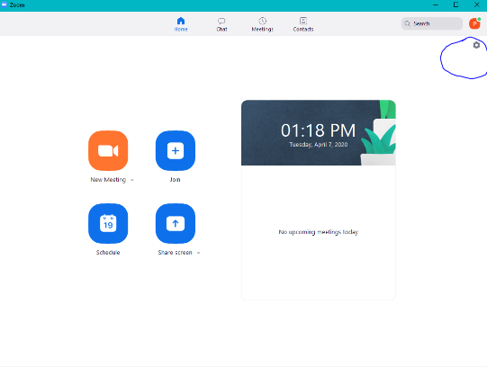

# How To Fix Webcam Issues
## Symptoms
Having trouble getting your computers webcam working with Zoom? Here are a few steps you can take to resolve the issue.
## How to
1. First step, check the function keys on your keyboard. The F1-F12 keys above the number keys, on laptops, often have functions to disable certain devices on a computer. If one of the function keys has a camera icon, this key is likely used to turn on and off the camera on the laptop.
2. Next check your Zoom settings to make sure it can see your camera

Click the Video tab on the right, and make sure the device is set to “Integrated Webcam” 

3. When you are in the Zoom Call, make sure to turn on video, 
And click the same button that looks like a pair of Headphones to turn on audio

4. If you still are not having any luck getting video on your device, please fill out a tech ticket [here](https://laurelschools.atlassian.net/servicedesk/customer/portal/2)