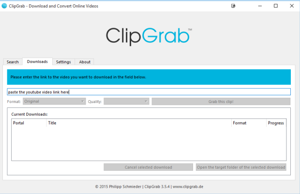

## How to Use ClipGrab
1. Go to youtube and find the video you want. Copy the url (web address).
2. Double click on the ClipGrab icon on your desktop to launch the program. If the icon is not on your desktop, go to `start > All Apps > Clip Grab`
3. Go to the Downloads tab. 
4. Paste the url (web address) of the video you want in the field located underneath the heading **Please enter the link to the video you want to download in the field below.**
5. Click the `Grab this clip!` button and a window will open asking where you want to save the video. For practicality purposes, choose your desktop (knowing you will move it to Google later). Click the `Save` button.