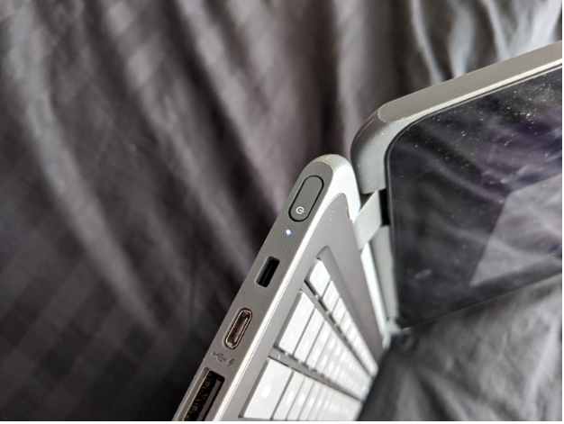
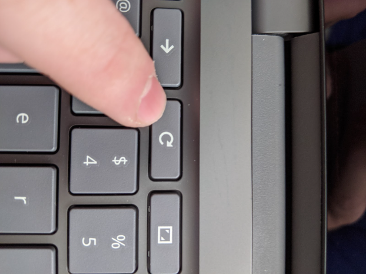

# How To Fix a frozen Chromebook

## Symptoms
Chromebook freezing up, stuck on a screen, unable to turn off? This can be remedied with a very simple step

## How To

1. Locate the power button (it will either be on the side, or above the number keys) 

2. Locate  the refresh button on the chromebook’s keyboard 

3. Hold both of these buttons until the screen turns off and then back on again.

## Conclusion
This is a fast and easy way to fix a frozen chromebook.  If this does not resolve the issue, please submit the chromebook to the school library for further repairs.