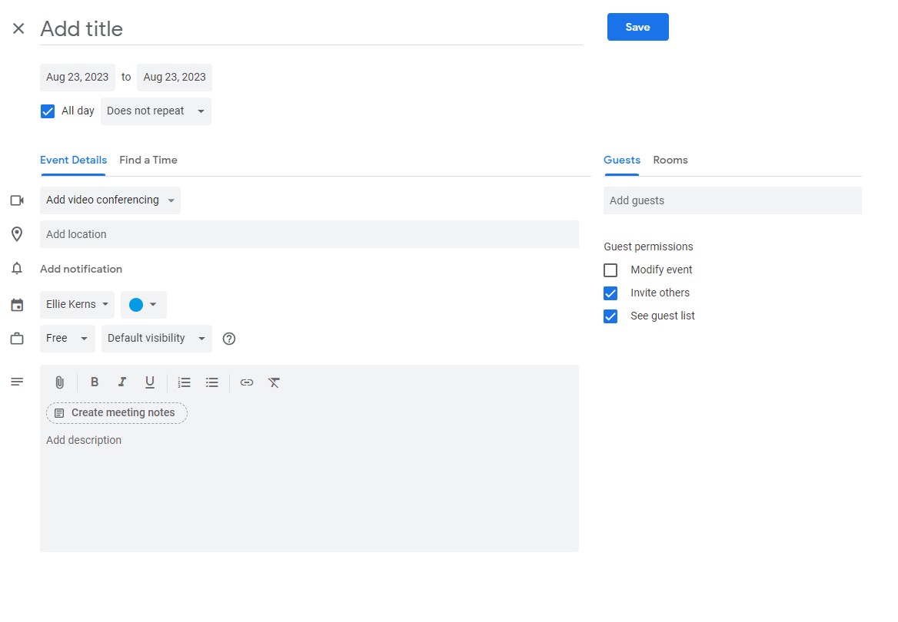
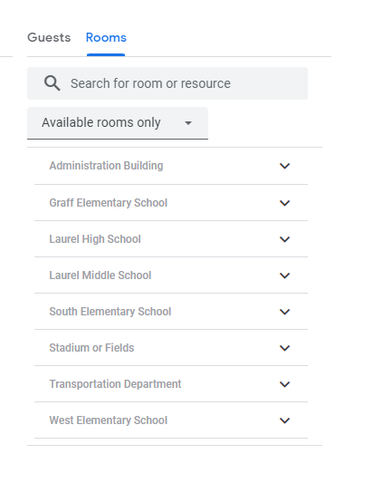
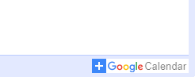

For staff members looking to reserve a space for use for any school related activity, such as activity practices, meetings, dances, etc, we have a different procedure in place. If this is not a school related activity, you still need to make a reservation on [https://facilities.laurel.k12.mt.us](https://facilities.laurel.k12.mt.us). For more information on what qualifies as needing a reservation, you can review the district policy [here](https://resources.finalsite.net/images/v1654615427/laurelk12mtus/yws9ab6wvlw3jdfr3kb5/laurelschooldistrictpolicymanual4262021.pdf)

## Google Calendar

Staff members now have the ability to simply reserve space for school use right from there google calendars. 

To start, you can double click on the day your event will take place or start to add a new event, which will pop up the event creation screen

From this screen you can select the date and time ranges for your event, put in notes, and most importantly, select your location. On the right side of the screen where you have Guests and Rooms, click on Rooms, and you'll be able to mark down your reservation at your desired location .

Our new system used for reservations syncs with our google calendars, so public reservations will exist within our internal systems, so your event may get declined if there is already an event taking place. You can reach out to our Activities Director to follow up on any potential conflicts. 

## Add Your Building's Master Calendar to Google

To see the public calendars of all events going on in your building, you can view them on the facilities website at [https://facilities.laurel.k12.mt.us/calendar](https://facilities.laurel.k12.mt.us/calendar). 

You can sort it by building, and if you want to add it to your own google calendar, you can click the Open Google Calendar button at the top of the page, this brings you to the google calendar version. In the bottom right hand corner of that screen, there is a plus icon 

Clicking that will add the calendar to your google calendar page so you can always keep track of whats happening!