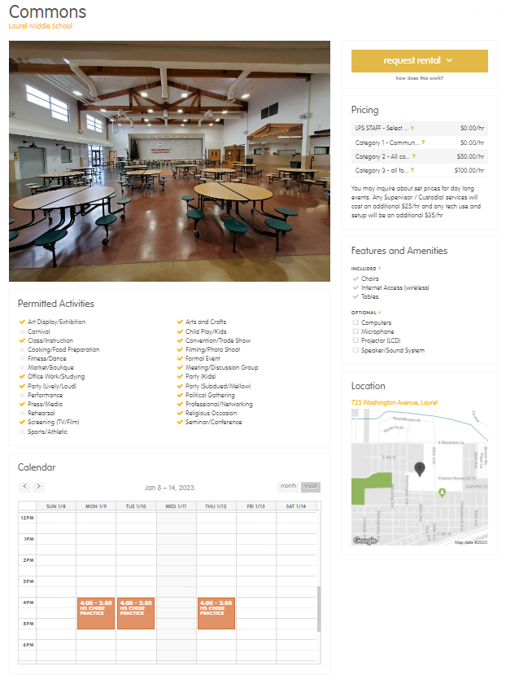
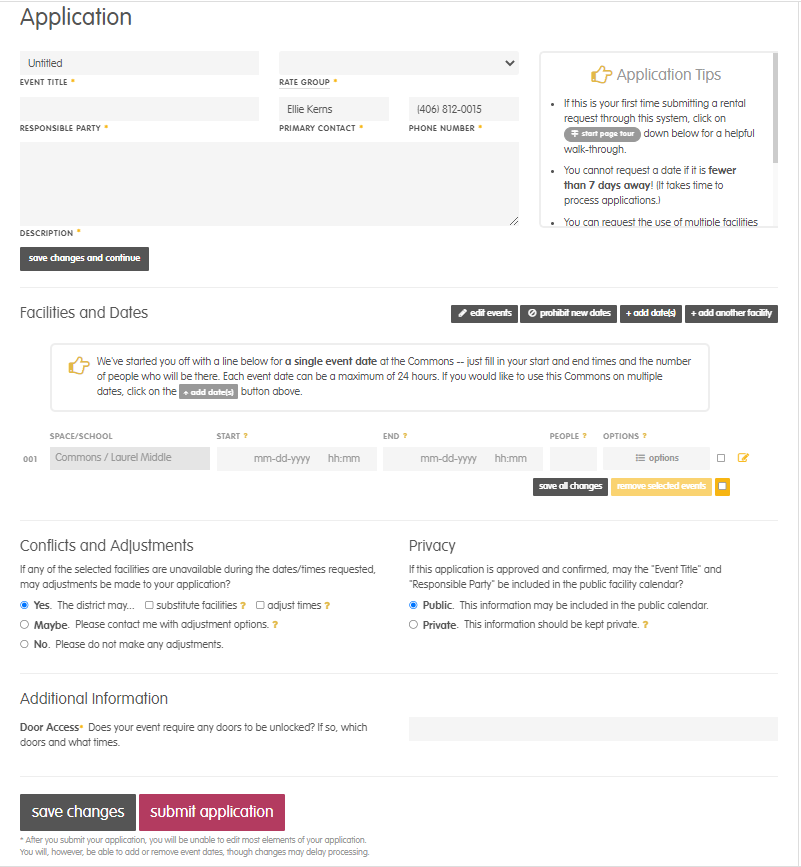
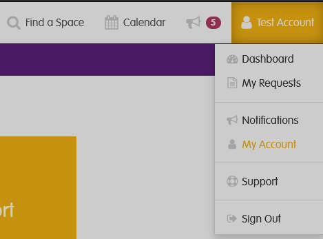

# How to Make a Facility Reservation

---

:::danger **IMPORTANT**
**This Page is currently out dated and will be updated soon, if you are having trouble with the reservation system, please email Ellie at [elliana_kerns@laurel.k12.mt.us](mailto:elliana_kerns@laurel.k12.mt.us)**
:::

## Accessing the reservation website

**Our reservation site is hosted by a 3rd party called SchoolSpace. You can reach the website here: [https://laurel.schoolspace.us](https://laurel.schoolspace.us)**

You will need an account in order to make a reservation. In the top right corner of SchoolSpace,  you can create an account, or sign in to an existing one.
_For LPS staff, this website does not tie into our accounts automatically, so you will still have to create an account, using your school email address._

---

## Making a reservation

---

### Finding a space

**From the front page seen above, you you can see the facilities we have available. You can either select one you see here, or**

- Click on a building on the map to select a space from there
- Click "find a space" in the top right corner to narrow down your search

**When you select a space you're interested in renting, you'll be brought to a page showing more details about the space**

This page gives you details such as

- Permitted Activities
- Features
- Pricing
- Calendar of events taking place (_note, that for non staff accounts, you will only see events that are listed as public. There may still be a private event happening at the time you wish to request. More on that in the next section_)

When you have found a space you would like to use, click **Request Rental** to start the application

---

### Application

**Next, You'll fill out the Application which has 4 main sections**

#### Details

- You'll need a title for your event / events
- Select your rate group. If you do not know this, make your best guess and we will adjust if necessary
- Responsible Party being either an organization or individual responsible for the event
- Primary contact, whoever we can reach out to with questions, payment information, etc.
- Description of the event, as much detail as you can give.

#### Facilities and Dates

Fill in the details for start, end, number of people(best guess) and any additional options. If there is already an event already taking place in the requested space, you will be prompted to select a different date when you submit the application.
:::caution
If this is a multi-day event, putting the start day and end day multiple days apart will result in your request being for every hour in between, so you will need to select the `+add date(s)` button.
:::

:::tip
If your event spans multiple spaces, say the gym and auditorium or LHS Gym and MS gym, you can click the `+add another facility` button to add them to your request without having to fill out a separate application for each space.
:::

#### Conflicts, Adjustments, and Privacy

- Select what you would like the district to do in the event of a conflict with your reservation
- Select whether your event is private or public. Public events(once approved) will be visible to anyone else making a request, and viewable on the district [website](https://laurel.k12.mt.us)

#### Additional Information

This last question asks about door access. Please state whether or not you need doors unlocked for your event, which doors, and for the specific times they need to be unlocked.

**After you have filled out all of the fields you can select `Submit Application` or `Save changes` if you want to stop and come back to it later.**

---

## Approval Process

**Once we receive your request, we will approve or decline it, or we may need to contact you for more information. Keep an eye on your email, you will receive a notice after it's been approved or declined, and if approved, you will need to sign our contract**

### Viewing your request status and contract

To check the status of your request at any time, you can return to the main page of [SchoolSpace](https://laurel.schoolspace.us) and once you're signed in, click your name in the top right corner, and click `My Requests`

**Once you have selected your current request, there are 6 tabs you will see at the top. `Summary` `Application` `Messages` `Insurance` `Documents` and `Agreement`. The last tab will not show up until your request has been approved.**

- Summary: A brief overview of your event(s) and approval status
- Application: Here you can review the same application you already submitted, and make changes if needed
- Messages: Here you can send the facilities team messages directly, and we may message you here as well. You will get email notifications if we send you a message.
- Insurance: You will need to upload proof of insurance before your event takes place, this is where you will do that.
- Documents: Upload any other necessary documents here.
- Agreement: Once approved, a contract will be generated that you will need to sign digitally on this page. This page states all of our district policies that you are agreeing to upon signing as well as the total pricing for your event. At the bottom of the page you mus check the boxes stating you agree to our policies and click submit.
  - Payment: At the bottom of the agreement you have the option to pay the fee's for your event online via card or bank account, or you may select to pay in person via cash or check

:::warning IMPORTANT
We may cancel your event at **ANY TIME** if you have not signed your agreement.
:::

## Contact us

If you have any issues or questions regarding this process, please contact:

| Who                                    | For                                                                                                 | How                                                   |
| -------------------------------------- | --------------------------------------------------------------------------------------------------- | ----------------------------------------------------- |
| Geralyn Hill - Facilities Secretary    | Questions regarding your application, agreement, rental fees, rental process                        | 406-628-3333 ext 3586, geralyn_hill@laurel.k12.mt.us  |
| Ellie Kerns - IT Systems Administrator | Questions or issues regarding the schoolspace website, or techknowledgy needs for your reservation. | 406-628-3333 ext 3304, elliana_kerns@laurel.k12.mt.us |
| Riley Mayo - Activities Director       | Questions regarding LPS sporting events or activities                                               | 406-628-3500 ext 3509, lpsactivities@laurel.k12.mt.us |
