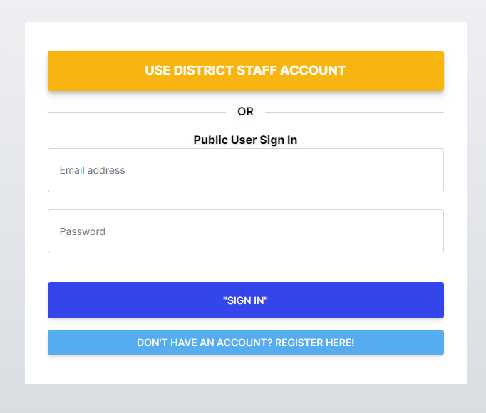
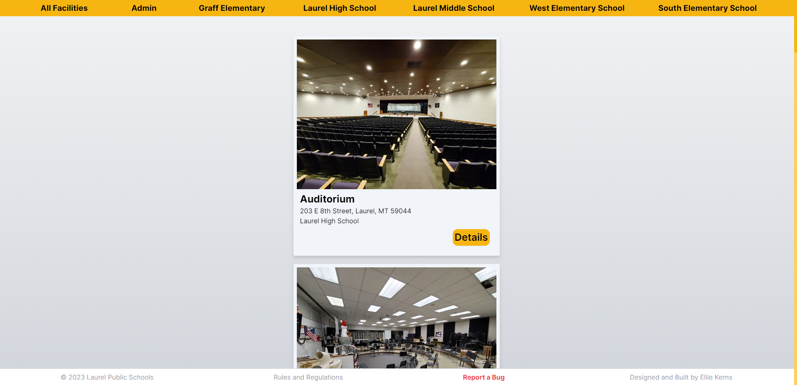
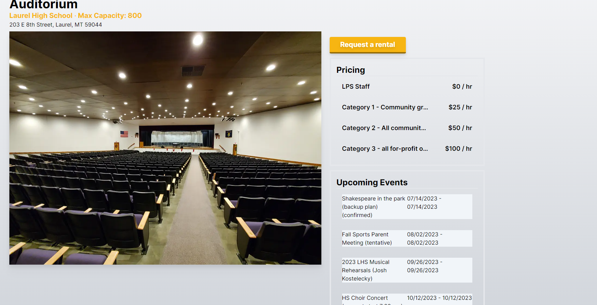
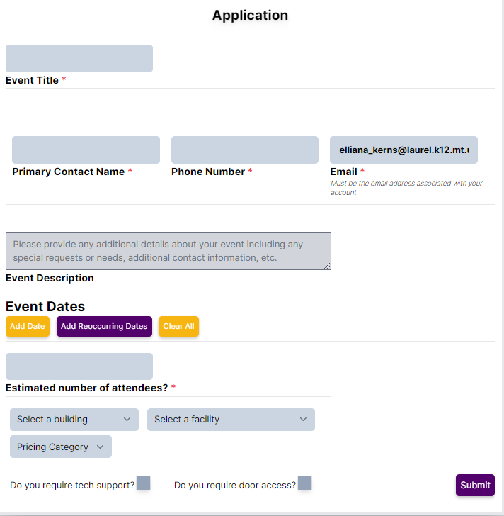
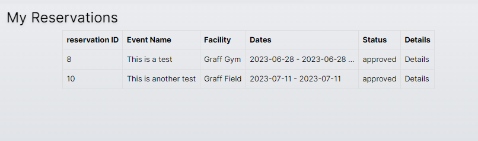
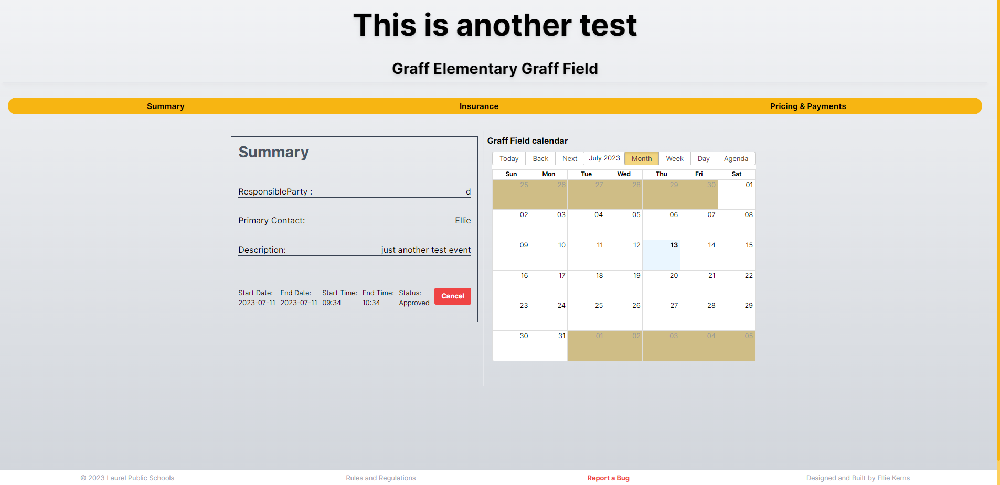
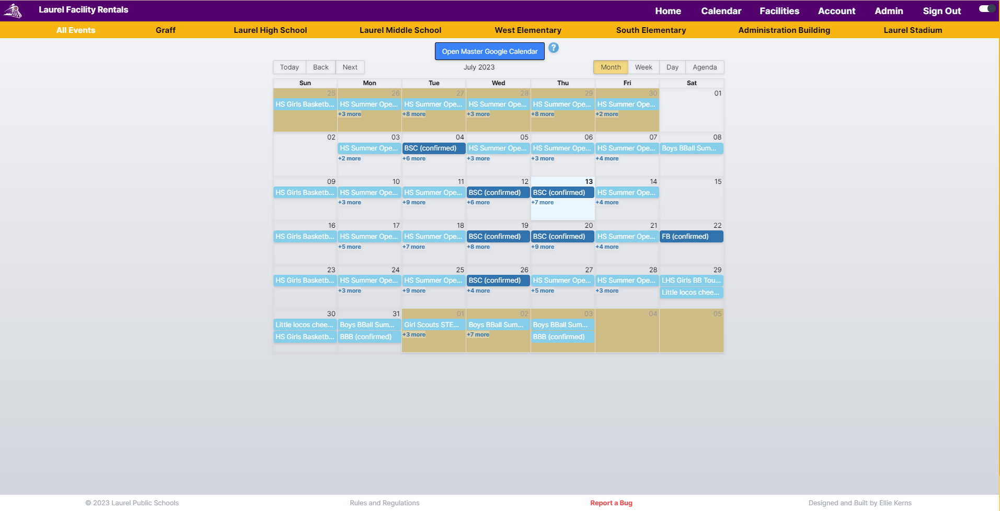

## Accessing the reservation website

---

**Our reservation site can be reached at** [https://facilities.laurel.k12.mt.us](https://facilities.laurel.k12.mt.us)

You will need to create an account to make a reservation. In the top right corner, click the sign in button to go to the login page. 

From here, LPS Staff members can click on `Use District Staff Account` and you'll automatically be logged in using your district account. Non staff can use a standard email and password, click the `Register Here` button to make a new account. 

## Making a reservation

### Finding a space

**From the navigation bar shown above, click on `facilities` to view our available facilities. You can use the yellow navigation bar to sort the facilities by school.**

**On the Details Page, you can view information such as upcoming events in the space, hourly pricing, and a link to the request form. The form can also be reached from the home page.**

### Rental Form

When you're ready to reserve a space, you can fill out the application. Please note that the required email field must be the same email address used for your account. If you have additional email contacts you'd like us to have, you can include them in the event description.

On this form you can reserve individual dates, or reoccurring dates for extended events such as sports practices.

You you also set your pricing category here but keep in mind, the district reserves the right to change this on your reservation if we determine you have selected the wrong one.

## Reservation Details

After you submit a request, it will need to be approved by district staff, and you will receive an email once it has been approved or denied. You can view the status of your requests by clicking the `Account` button on the top of the website. 

When you click on `Details`, you'll be taken to a page where you can view and update your reservation, upload insurance, and view payment options. 
On the `Pricing & Payments` page you can elect to pay in person or make your payment online. Online payments are processed securely through Square.

## Calendar

All of the district's events can be viewed on the `Calendar` page, which can be accessed from the navigation bar at the top of the page, or the `Calendar` button on the Home page. You can use the Yellow bar at the top of the page to sort the events by building, and if you click the blue `Open Google Calendar` button, you can add the calendars to your own google calendar!

## Contact us

If you have any issues or questions regarding this process, please contact:

| Who                                    | For                                                                                  | How                                                   |
| -------------------------------------- | ------------------------------------------------------------------------------------ | ----------------------------------------------------- |
| Geralyn Hill - Facilities Secretary    | Questions regarding your application, agreement, rental fees, rental process         | 406-628-3333 ext 3586, geralyn_hill@laurel.k12.mt.us  |
| Ellie Kerns - IT Systems Administrator | Questions or issues regarding the website, or technology needs for your reservation. | 406-628-3333 ext 3304, elliana_kerns@laurel.k12.mt.us |
| Andrew Torgerson - Activities Director | Questions regarding LPS sporting events or activities                                | 406-628-3500 ext 3509, lpsactivities@laurel.k12.mt.us |

## LPS Staff

Our staff members now have a new way to reserve a space for use that does not require a reservation at all

:::note
This only applies to school events such as choir concerts, basketball practice, etc.
:::

Staff can simply use google calendar to make their event. On the right side of the screen, select the `Rooms` tab, and you can mark whichever spaces you will be using for your event. 
Any event added this way will automatically be synced with the reservation system, so the public view will still show the event taking place at your reserved time.
