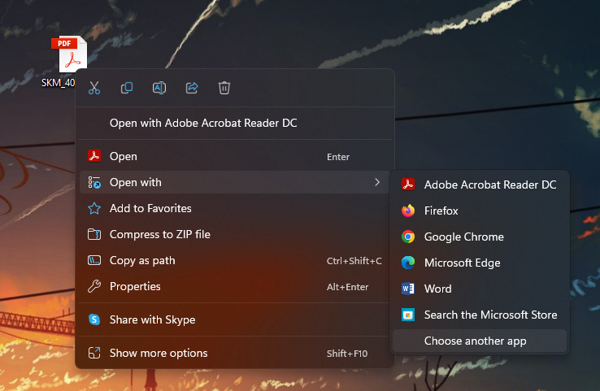

# How to open a PDF file using chrome

Sometimes, especially after an update, Windows tries to make Edge the default program to open PDF files. Here is how to swap the default program back to chrome:

---

1. Right click on the pdf file you are wanting to open, hover over ``open with`` and select ``choose another app``

2. In the popup window, select ``chrome``, *or adobe acrobat if you have it installed*, and click ``always``.

And that should resolve your problem. You have now told Windows to always open PDF files with the selected program. Just a reminder that this may switch back to edge after an update.