This is a quick tutorial on how to get started with Windows Remote Desktop Services (rds) on Chromebooks.

## Logging in

1. Start on the login screen of the chromebook, if you are currently signed into the chromebook, sign out.
2. Click on ```apps``` in the bottom left hand corner of the screen, then click on `https://rds-gateway.laurel.local/` 

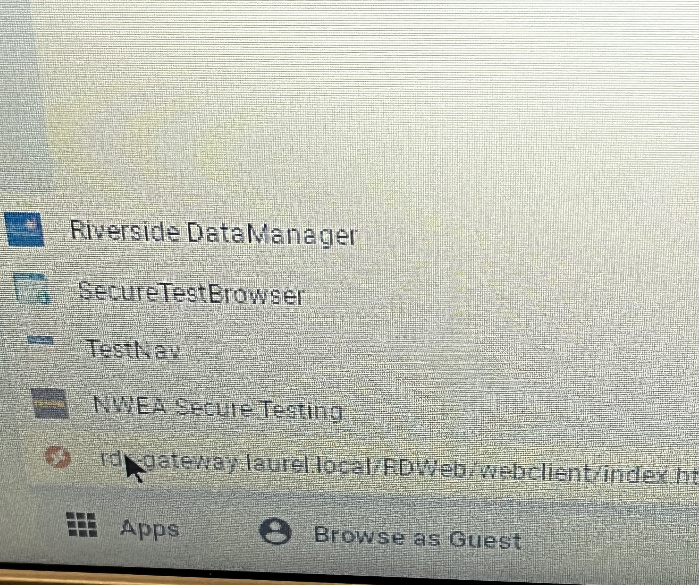

4. Next, you will be asked to sign in. Use your normal computer login, username:  `firstnamelastname` for students and `firstname_lastname` for staff, and your district password

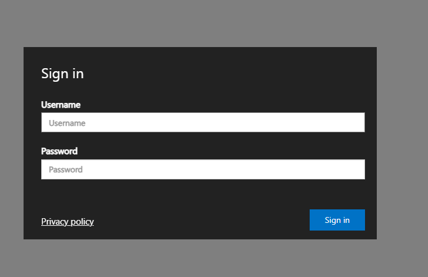

4. Now you'll visit the dashboard. Here you will see available apps you can connect to. Right now, we only have a full desktop experience, but in the future, you may be able to open isolated applications from this window such as VS Code, 3d print software, office, and more! For now, click on the `LHS Desktop` icon to launch a desktop session.
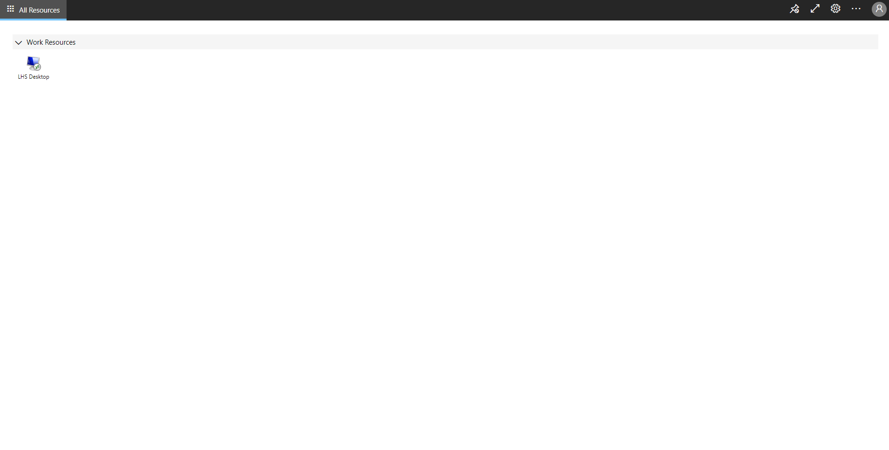


And thats it, you're now using Windows on your chromebook! You can click the unpin icon 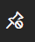 to hide the navigation bar at the top of your screen. 

## Connecting to Google Drive

On our remote desktop solution, while your data can be saved to the computer, don't think of it as permanent. At the end of every semester, the profiles will be wiped from the server in interest of saving space, and because this is a new system for the district, it could possibly be wiped at any time as we make changes to it. Therefore it is a good practice to save your files to google drive. 

### Sign into chrome browser

You'll want to make sure you are signed into the chrome browser before starting this or it can lead to a [bug](#bug) 

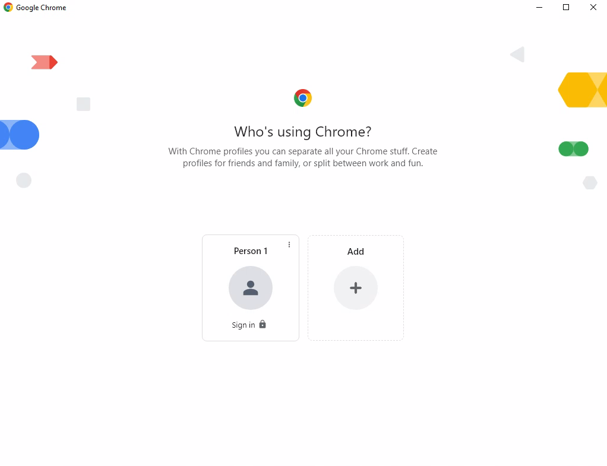

 Be sure to click on continue here 
 
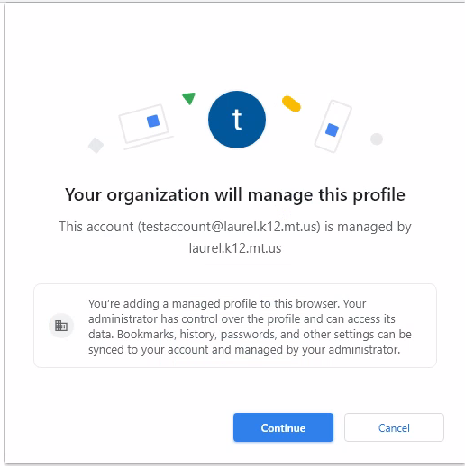

---

### Launch Google Drive Application

You can use the normal browser page at [drive.google.com](drive.google.com) to upload files, but you can also use the built in desktop app to save files directly from Windows. To do this, search for `Drive` in the windows search bar, then click the Google Drive icon.
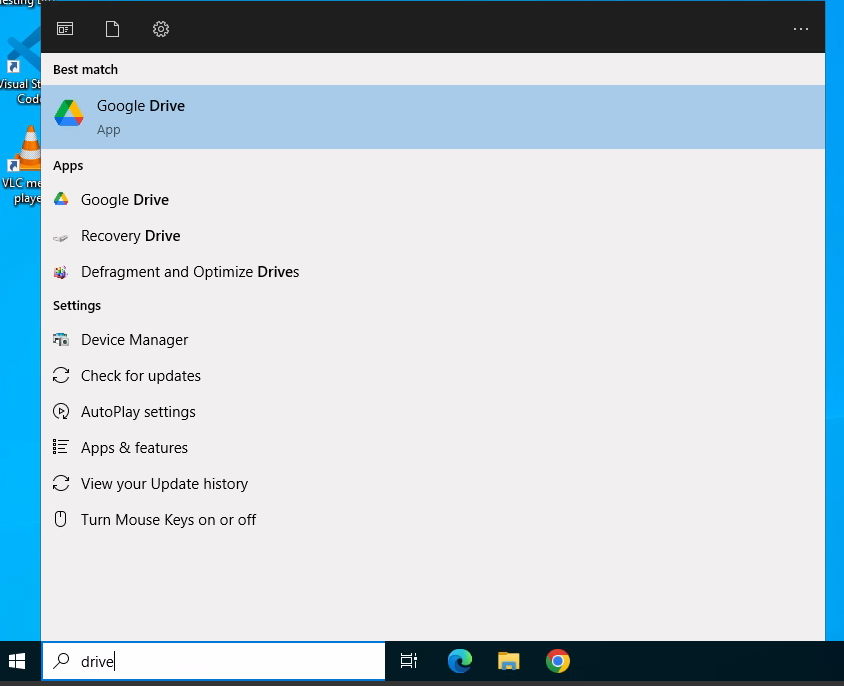

It will pop up with a window asking you to sign into your google account.

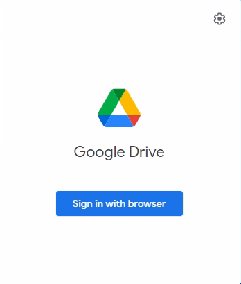 

If this does not pop up, you can find the icon in the system tray in the bottom right corner, click on that, and it will pop up. 
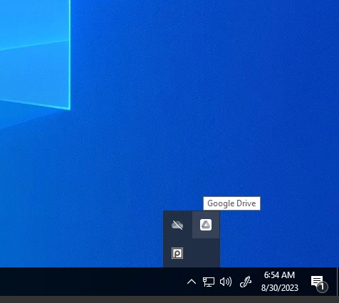


--- 

### Usage

Once you're signed in, you'll have a new addition to your file explorer just like you've plugged in a flash drive, labeled Google Drive. You can find it in the explorer side bar or on the This PC tab
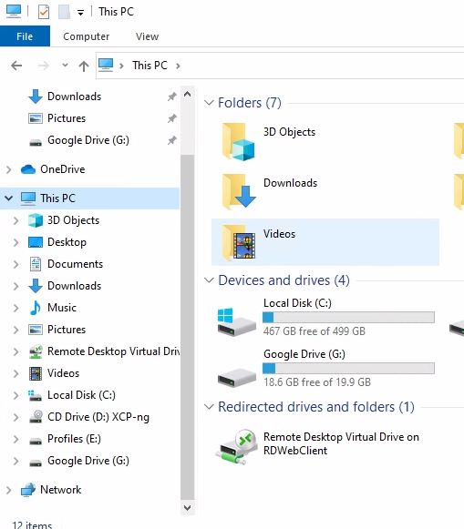

You can store all your files there as if you were saving files anywhere else on the computer, and they will save to your google drive. This also works the opposite direction, you can pull files from your google drive directly to windows and use them locally. 


--- 

### Potential-Bug {#bug}

We've seen drive hang up after first trying to sign in and logging into the app. To get past this, click on the little icon in the system tray again and click cancel here

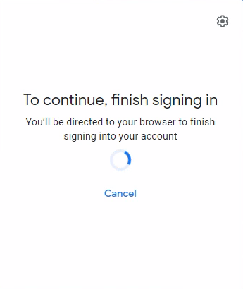

Then click `Sign in with browser` again, select your account again

---
## Logging out

To disconnect from Windows, simply push the power icon and the refresh  icon at the same time. This will bring you back to the chromebook login screen. 

## Usage and Bug Reporting

While RDS is a pretty seamless user experience, there are some things to take note of. 
1. Slight input lag is normal. Note that you are connecting to a different computer over wifi, so its normal to expect some slight lag on your screen sometimes. 
2. Certain graphical functions have been disabled to improve stability, so you cannot change the background or color scheme.
3. Your files will be deleted when you log out! Make sure to save anything important to google drive!


If you experience any issues or bugs with RDS you can report them [HERE](https://laurelschools.atlassian.net/servicedesk/customer/portal/2/group/12/create/89)