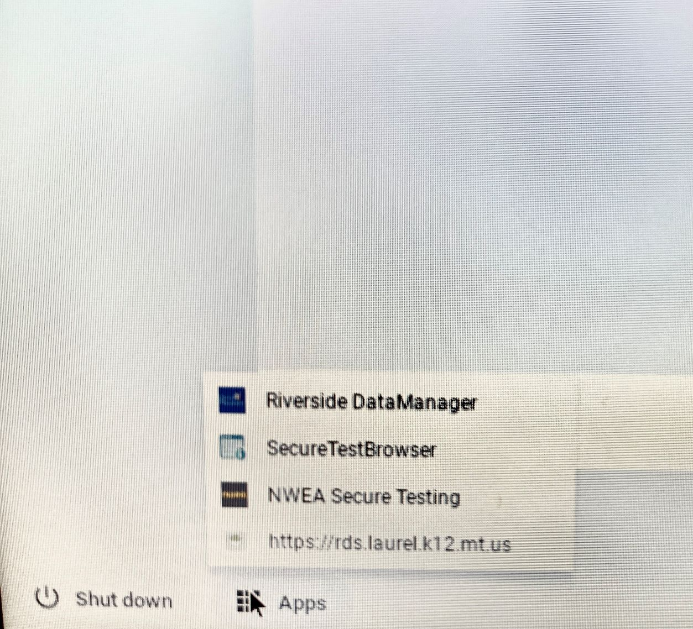
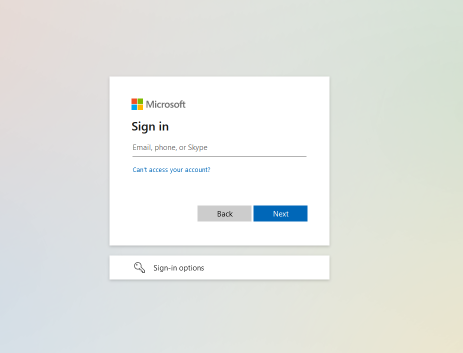
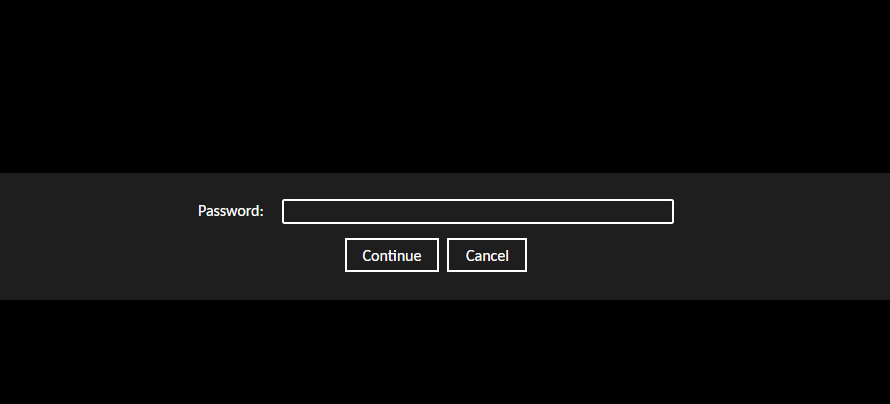

This is a quick tutorial on how to get started with Windows Remote Desktop Services (rds) on Chromebooks.

## Logging in

1. Start on the login screen of the chromebook, if you are currently signed into the chromebook, sign out.
2. Click on ```apps``` in the bottom left hand corner of the screen, then click on ```https://rds.laurel.k12.mt.us```

	
:::danger Do not attempt to run RDS from google chrome in your chromebook. Yes, the app to get in is a URL, but attempting to login from the browser will likely crash your chromebook or cause other issues.
:::

3. Next, you will be asked to sign in. Use your school email and password.


4. You will then get to a black screen, and asked to enter your password one more time


And thats it, you're now using Windows on your chromebook.

## Logging out

To disconnect from Windows, simply push the power icon and the refresh  icon at the same time. This will bring you back to the chromebook login screen. 

## Usage and Bug Reporting

While RDS is a pretty seamless user experience, there are some things to take note of. 
1. Slight input lag is normal. Note that you are connecting to a different computer over wifi, so its normal to expect some slight lag on your screen sometimes. 
2. Certain graphical functions have been disabled to improve stability, so you cannot change the background or color scheme.
3. Your files will be deleted when you log out! Make sure to save anything important to google drive!


If you experience any issues or bugs with RDS you can report them [HERE](https://laurelschools.atlassian.net/servicedesk/customer/portal/2/group/12/create/89)