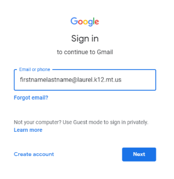
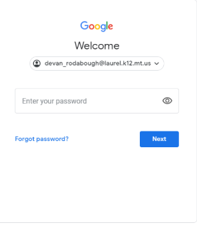
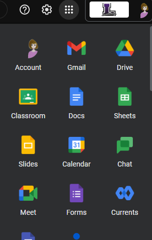

# How to Sign into Google Services

## How To
1. Navigate to the Google service you wish to sign in to. In our case, we will use [https://www.gmail.com](https://www.gmail.com) 
2. Type in your email address. For students this is firstnamelastname@laurel.k12.mt.us, then click next. 
3. Type in your password in the password field, then click next. This is the one that you usually use at school. 
4. That should sign you in! From here you can click on the top right portion of the screen to open up all apps and switch to a different service.

## CONCLUSION
Some other websites you may need:

https://drive.google.com

https://classroom.google.com
